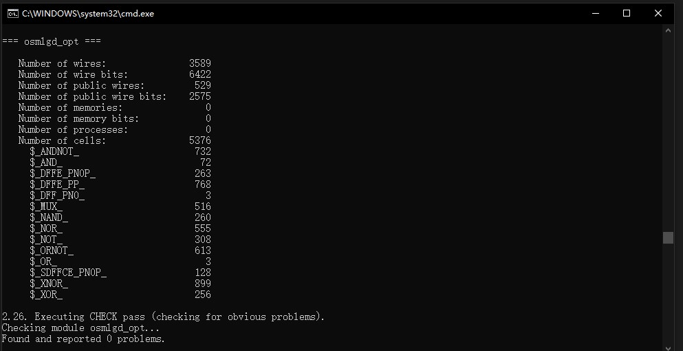

## Introduction
This repository is an easy LDPC implementation. It inlcudes python programs for encoding and decoding and verilog file for OSMLGD decoder. The aim is to learn and simulate LDPC algorithm. The requirement enviornment is python, iverilog, gtkwave and yosys. The tools are all open-source and suitable for win and linux. 

## Reference
The theory refers to 何昌伟. LDPC码快速译码算法的研究与改进[D].重庆邮电大学,2016.

The software refers to https://github.com/SkyeWoo/simLDPC.

## Floder tree
/software
LDPC_endecode.m is the top file to test matlab file function.
LDPC_decode.py is decode method of hard-decision in python.
test_getinfo_encode.m generates and saves H-array and encoded information.
test_snr.py tests three hard-decision decoding method in different SNR and save decoding results.

/hardware

/adder/add_gen.py to generate adder1 ot adder128

/adder/256bites_adder.py to generate 128bit and 256 bite serial adder

/test/ tests initial instance mem in a testbench.

/sim_data/ contains simulating files of python and results of verilog.

/256sum_lastbit.py write 256sum_lastbit.v to instantiate 256-bit adder and assign the last bit.

/128sum_lastbit.py write 128sum_lastbit.v to instantiate 256-bit adder and assign the connecting wires.

/dot_compare_for.py write dot_compare_for.v to replace 'for' for yosys.

/osmlgd_top.v is the osmlgd decoder.

/osmlgd_top.sh is the script for simulating. It includes program compiling, rtl simulating and synthesis.

/opt_hardware

/H_value.py to write H_value.v to write H directly to netlist to optimize hardware resource

/osmlgd_opt.v is osmlgd decoder faced to FPGA

